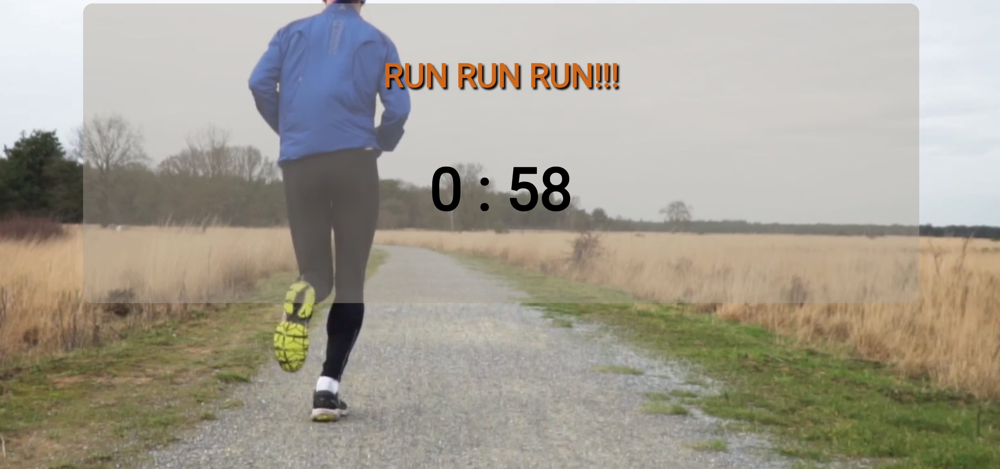
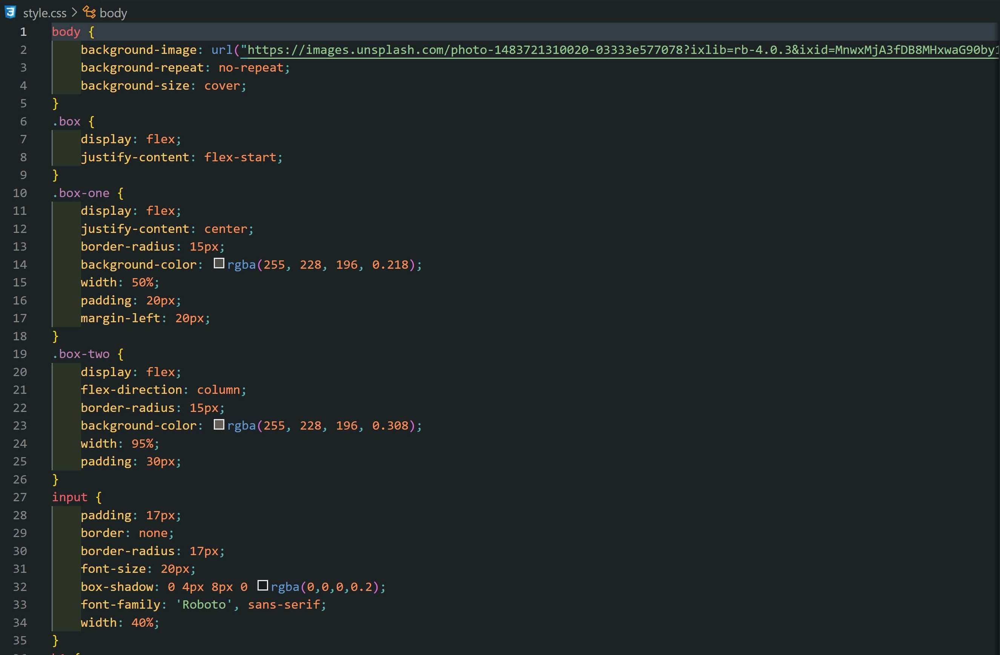

<a name="readme-top"></a>
<div>
  <h1 align="center">Hi there, I'm <a href="https://www.instagram.com/prostofil_ka/" target="_blank">Anna</a></h1>
</div>
<br />
<!-- PROJECT LOGO -->
<br />
<div align="center">
  <a href="https://github.com/Nyushaf/Running-timer.git">
    
  </a>

  <h3 align="center">Running timer</h3>

  <p align="center">
    An interesting option of a timer for training. 
       <br />
    <a href="https://github.com/Nyushaf/Running-timer"><strong>Explore the docs »</strong></a>
    <br />
    <br />
    ·
    <a href="https://running-timer.netlify.app">View Demo</a>
    ·
  </p>
  <a name="readme-top"></a>
</div>


<!-- TABLE OF CONTENTS -->
<details>
  <summary>Table of Contents</summary>
  <ol>
    <li>
      <a href="#about-the-project">About The Project</a>
      <ul>
        <li><a href="#built-with">Built With</a></li>
      </ul>
    </li>
    <li>
      <a href="#getting-started">Getting Started</a>
      <ul>
        <li><a href="#installation">Installation</a></li>
      </ul>
    </li>
    <li><a href="#usage">Usage</a></li>
    <li><a href="#contact">Contact</a></li>
  </ol>
</details>

<!-- ABOUT THE PROJECT -->
## About The Project



This is a timer project for sports training. It allows the user to set their own parameters, such as:  
* workout time,
* rest time,
* number of repetitions.

  


<p align="right">(<a href="#readme-top">back to top</a>)</p>

### Built With

The following tools were used to create this project:

* 
* 
* 
* 

<p align="right">(<a href="#readme-top">back to top</a>)</p>

<!-- GETTING STARTED -->
## Getting Started

To get a local copy up and running follow these simple example steps.

### Installation

1. Copy link: <strong>https://github.com/Nyushaf/Running-timer.git</strong>
2. Clone the repo 
   ```sh
   git clone https://github.com/Nyushaf/Running-timer.git
   ```
3. To use GSAP do not forget cocy this link
   ```sh
   <script src="https://cdnjs.cloudflare.com/ajax/libs/gsap/3.11.5/gsap.min.js"></script>
   ```
  
<p align="right">(<a href="#readme-top">back to top</a>)</p>


<!-- USAGE EXAMPLES -->
## Usage

Change parametrs CSS
   
<br />
<br />
You can change parametrs for animation
   ```sh
   gsap.from (".box-one", {x: 500, easy: "bounce", opacity: 0, duration: 1.5, delay: .5})
   ```
  
<p align="right">(<a href="#readme-top">back to top</a>)</p>

<!-- CONTACT -->
## Contact

Anna Filina - [linkedin](https://www.linkedin.com/in/anyuta-filina-40a131265/) - nyushaf@gmail.com

Project Link: [https://github.com/Nyushaf/Running-timer.git](https://github.com/Nyushaf/Running-timer.git)

<p align="right">(<a href="#readme-top">back to top</a>)</p>
